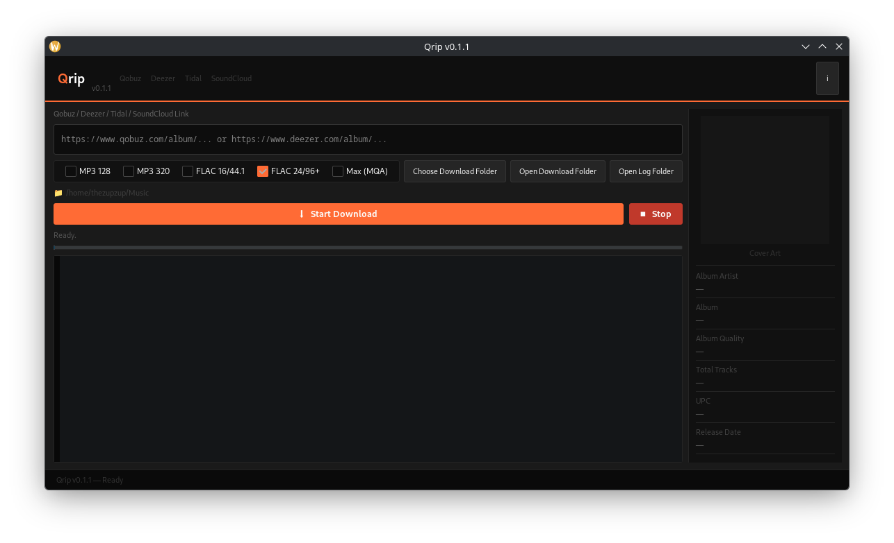

# Auryn
[](https://github.com/TheZupZup/Auryn/releases/latest)
[](https://hub.docker.com/r/thezupzup/Auryn)
[](#)


Auryn is a graphical interface for an existing open-source tool. It does not provide, host, or distribute any content.

<p align="center">
  
</p>

<p align="center">
  
</p>

<p align="center">
  <b>graphical interface for an existing open-source command-line tool</b>
</p>

## Announcement
- .deb package available in Releases
- Flatpak support in progress

---

## Features

- Simple and intuitive GUI for managing local audio workflows
- Manage and organize local audio libraries
- Support for high-quality audio formats (FLAC, etc.)
- Real-time progress and logs
- One-click workflow (no terminal required)

---

## Why Auryn?

Building and managing a personal local audio library

It is designed for users who want:

- Full control over their music collection
- High-quality audio (FLAC / Hi-Res)
- A clean and easy workflow
- A solution that integrates with self-hosted setups

---

## Use Case

Auryn is ideal for:

- Building a local music library
- Storing music on a NAS
- Creating a self-hosted media ecosystem
- Using media servers like Jellyfin

---

## Workflow
Input Source → Auryn → Local/NAS Library → Media Server → Playback


---

## Installation

Tested on Linux Mint / Debian-based systems

Download the `.deb` package from the releases section:

https://codeberg.org/TheZupZup/Auryn/releases

Then install:

```bash
sudo dpkg -i Auryn.deb
```

## Docker (Advanced / NAS / Server)

Auryn is available as a Docker image for advanced users, NAS environments, or server setups.

**Docker Hub:** [thezupzup/Auryn](https://hub.docker.com/r/thezupzup/Auryn)

### Prerequisites

Since Auryn is a GUI application, you need to allow the container to access your X11 display server:

```bash
xhost +local:docker
```

### Option 1: Docker Run

You can start the container with a single command:

```bash
docker run -d \
  --name auryn \
  -e DISPLAY=$DISPLAY \
  -v /tmp/.X11-unix:/tmp/.X11-unix \
  -v $(pwd)/downloads:/root/Music \
  thezupzup/Auryn
```

**Parameters Explained:**
- `-e DISPLAY=$DISPLAY`: Passes your host's display environment variable to the container.
- `-v /tmp/.X11-unix:/tmp/.X11-unix`: Mounts the X11 socket for GUI rendering.
- `-v $(pwd)/downloads:/root/Music`: Maps your local downloads folder to the container's output directory.

### Option 2: Docker Compose (Recommended)

For a more manageable setup, use a `docker-compose.yml` file:

```yaml
services:
  auryn:
    image: thezupzup/Auryn
    container_name: auryn
    environment:
      - DISPLAY=${DISPLAY}
    volumes:
      - /tmp/.X11-unix:/tmp/.X11-unix
      - ./downloads:/root/Music
    network_mode: host
    restart: unless-stopped
```

**To run with Docker Compose:**
1. Create a `docker-compose.yml` file with the content above.
2. Run `docker-compose up -d`.
---

## Windows experimental

Windows support is experimental. The app has a cross-platform path layer and an experimental Windows runtime path, but GTK/PyGObject on Windows is not trivial to set up and the experience is not as polished as on Linux.

### Requirements

- Python 3.11+
- [streamrip](https://github.com/nathom/streamrip) installed and available on `PATH` as `rip`
- GTK 4 and PyGObject installed through a supported Windows method (for example MSYS2, or another PyGObject-compatible environment)

### Basic setup

```bat
git clone https://github.com/TheZupZup/Auryn.git
cd Auryn

python -m venv .venv
.venv\Scripts\activate

pip install -r requirements.txt

:: install streamrip (either inside the venv)
pip install streamrip

:: ...or as an isolated CLI via pipx
pipx install streamrip

python src\Auryn.py
```

Make sure `rip --version` works from the same shell before launching Auryn.

### Notes

- Windows support is **experimental** and not officially supported yet.
- GTK installation may require MSYS2 or another PyGObject-compatible setup; follow the official PyGObject Windows instructions to get `gi` importable from your Python environment.
- On Windows, downloads run through a pipe-based subprocess path instead of the PTY-based path used on Linux. Output capture and progress parsing may behave slightly differently.
- Issues and PRs are welcome, especially for Windows packaging improvements (installers, GTK bundling, CI).
- Planned packaging approach: see [docs/windows-packaging.md](docs/windows-packaging.md).

---

## Project Status

This is an actively developed project.

It is part of my open-source learning journey, and I am continuously improving it.

Feedback, suggestions, and contributions are welcome.

---

## Future Ideas

Better library organization

Improved UI/UX

Offline-ready workflows

Integration with self-hosted media systems

---
## Disclaimer & Legal

Auryn is a graphical interface for an existing open source audio tool and does not provide, host, or distribute any content.

This software is intended for legitimate use with content you own or are authorized to access.

Users are responsible for ensuring that their use of this tool complies with applicable laws and the terms of service of any platforms they access.

The developer of Auryn does not encourage or support misuse of this software.

---

### Limitations

This program does not include:

- Any functionality related to restricted or protected content access
- Any application IDs, secrets, or private API keys
- Any tools intended to violate platform terms of service

---

### Technical clarification

Auryn is a GUI frontend for an existing open-source command-line tool.
It does not host, distribute, or provide access to copyrighted content, and it does not directly interact with any online services.

---

### Trademarks

Qobuz, Deezer, Tidal, and SoundCloud are registered trademarks of their respective owners.  
Auryn is not affiliated with, endorsed by, or sponsored by any of these services.

---

### Terms of Service

Users should ensure that their usage complies with the Terms of Service of the platforms they access, including:

- [Qobuz Terms of Service](https://www.qobuz.com/us-en/info/legal/terms-of-use)
- [Deezer Terms of Service](https://www.deezer.com/legal/cgu)
- [Tidal Terms of Service](https://tidal.com/terms)
- [SoundCloud Terms of Service](https://soundcloud.com/terms-of-use)

---

## Acknowledgment

This project was created with the help of AI tools as part of my learning process.

---
## Author

Created by TheZupZup

---
## License

Copyright (C) 2025 TheZupZup — Auryn  
Licensed under the [GNU General Public License v3.0](https://www.gnu.org/licenses/gpl-3.0.en.html)

