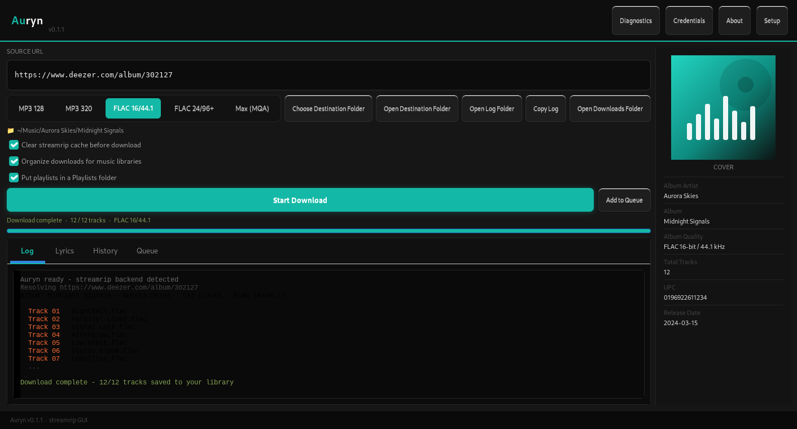

<p align="center">
  
</p>

<h1 align="center">Auryn</h1>

<p align="center">
  <b>A privacy-friendly desktop GUI for <a href="https://github.com/nathom/streamrip">streamrip</a>.</b><br>
  Build and organize a high-quality local music library — no terminal required.
</p>

<p align="center">
  <a href="https://github.com/TheZupZup/Auryn/actions/workflows/python-app.yml"></a>
  <a href="https://github.com/TheZupZup/Auryn/actions/workflows/linux-packages.yml"></a>
  <a href="https://github.com/TheZupZup/Auryn/releases/latest"></a>
  <a href="https://www.gnu.org/licenses/gpl-3.0.en.html"></a>
  
</p>

<p align="center">
  
</p>

---

## What is Auryn?

Auryn is a clean, dark-themed graphical front-end for [streamrip](https://github.com/nathom/streamrip),
the open-source command-line audio downloader. It turns streamrip's terminal
workflow into a one-window desktop app: paste a link, pick a quality, and watch
progress, metadata, cover art, and lyrics appear as your library grows.

Auryn does **not** host, distribute, or provide access to any content. It is a
GUI wrapper around a tool you install yourself — you supply your own
credentials and you are responsible for using it within the terms of the
services you access.

---

## Features

- **Deezer (recommended)** — the most reliable choice for large-catalog
  workflows, with FLAC 16/44.1 downloads.
- **Qobuz Hi-Res** — best option when you want 24-bit / Hi-Res audio.
- **TIDAL (experimental)** — supported, but authentication has known
  limitations and may require manual setup.
- **SoundCloud** — supported for public tracks and sets.
- **Sequential download queue** — line up multiple URLs; they run one after
  another.
- **Metadata & cover sidebar** — artist, album, quality, track count, UPC, and
  release date alongside the album art.
- **Log, Lyrics, History, and Queue tabs** — follow live output, view synced
  lyrics, review past downloads, and manage the queue.
- **Diagnostics & setup tools** — built-in `--doctor` preflight checks plus an
  in-app Setup / Credentials / Diagnostics workflow.
- **Linux packages** — installable `.deb` and `.rpm` builds.
- **Experimental Windows build** — best-effort PyInstaller bundle plus a
  source zip (see [Windows notes](#windows-experimental)).

---

## Supported services

| Service | Status | Best for | Typical quality |
|---|---|---|---|
| **Deezer** | ✅ Recommended | Large catalogs, reliable downloads | FLAC 16/44.1 |
| **Qobuz** | ✅ Supported | Hi-Res audio | FLAC up to 24-bit |
| **TIDAL** | ⚠️ Experimental | — | Authentication has known limitations |
| **SoundCloud** | ✅ Supported | Public tracks & sets | Service-dependent |

> You provide your own account credentials. Auryn ships no application IDs,
> secrets, or API keys.

---

## Installation

### Download a release

Grab the latest packages from the
[**Releases**](https://github.com/TheZupZup/Auryn/releases/latest) page.

**Debian / Ubuntu / Linux Mint (`.deb`)**

```bash
sudo dpkg -i Auryn_*.deb
sudo apt-get install -f   # pull in any missing dependencies
```

**Fedora / RHEL / openSUSE (`.rpm`)**

```bash
sudo rpm -i Auryn-*.rpm
# or: sudo dnf install ./Auryn-*.rpm
```

**Windows (experimental)**

Download the `auryn-windows-*` artifact (zip / exe) from a release or CI run.
Windows support is experimental — see [Windows notes](#windows-experimental)
before you start.

### From source

```bash
git clone https://github.com/TheZupZup/Auryn.git
cd Auryn
pip install -r requirements.txt
python3 src/Auryn.py
```

Auryn needs **Python 3.11+**, **GTK 3 / PyGObject** (`python3-gi`,
`gir1.2-gtk-3.0`), and **streamrip** on your `PATH`.

---

## Setup

1. **Install streamrip** so the `rip` command is available:

   ```bash
   pipx install streamrip     # isolated CLI (recommended)
   # or
   pip install streamrip
   ```

   Verify it works: `rip --version`.

2. **Run the doctor** to confirm your environment is ready:

   ```bash
   python3 src/Auryn.py --doctor
   ```

   It checks Python, GTK/PyGObject, the `rip` executable, the streamrip config,
   and your music folder. Add `--verbose` for extra detail when filing reports.

3. **Configure credentials** from inside Auryn via the **Setup** and
   **Credentials** buttons. For Deezer, add your ARL cookie under
   **Setup → Deezer**, then Save. Auryn writes to streamrip's own config — it
   never stores secrets of its own.

---

## Troubleshooting

**`streamrip` / `rip` not found**
Make sure streamrip is installed and on the same `PATH` Auryn runs from. Test
with `rip --version`. If you used `pipx`, ensure `~/.local/bin` is on your
`PATH`.

**Missing `config.toml`**
streamrip creates its config on first run. Launch `rip` once, or use Auryn's
**Setup** dialog, then re-run `--doctor` to confirm the config is detected.

**"Deezer not configured"**
Deezer downloads need an ARL cookie. Open **Setup → Deezer**, paste your ARL,
and Save. Then retry the download.

**TIDAL authentication**
TIDAL is experimental. Auth tokens can expire or fail to refresh; you may need
to re-authenticate via streamrip directly. Treat TIDAL as best-effort for now.

**Windows notes**
GTK/PyGObject must be installed through a supported method (e.g. MSYS2).
Downloads use a pipe-based subprocess path instead of the Linux PTY path, so
progress output may differ slightly. The build is unsigned and has no
installer. See [docs/windows-packaging.md](docs/windows-packaging.md).

---

## Windows (experimental)

Windows support is **experimental and not officially supported yet**. The app
has a cross-platform path layer and an experimental Windows runtime path, but
GTK/PyGObject on Windows is not trivial to set up and the experience is less
polished than on Linux.

The `Windows packaging (experimental)` workflow
([`.github/workflows/windows-exe.yml`](.github/workflows/windows-exe.yml)) runs
on `windows-latest` and can produce:

- `auryn-windows-onedir-<version>` — a best-effort standalone PyInstaller
  `--onedir` bundle (may be incomplete on a given run).
- `auryn-windows-source-<version>` — an always-produced source-only zip with a
  `README-WINDOWS.txt` explaining how to run Auryn against a manually installed
  MSYS2 / GTK3 / PyGObject toolchain.

Contributions toward better Windows packaging (installers, GTK bundling, CI)
are especially welcome.

---

## Contributing

Contributions are welcome — please keep them small and focused.

- **One change per PR.** Small, reviewable pull requests get merged faster.
- **Never push to `main`.** Branch from `main` and open a PR against it. See
  [CONTRIBUTING.md](CONTRIBUTING.md) for the full branch rules.
- **Don't change download logic or break Deezer support** without discussion.

Run the same checks CI runs before opening a PR:

```bash
python3 -m py_compile src/Auryn.py    # syntax check
python3 -m pytest                     # unit tests (GTK-free core)
flake8 . --select=E9,F63,F7,F82       # lint for real errors
```

---

## Project status

Auryn is actively developed and part of an open-source learning journey.
Feedback, bug reports, and pull requests are all appreciated.

---

## Disclaimer & legal

Auryn is a graphical interface for an existing open-source audio tool. It does
not host, distribute, or provide access to copyrighted content, and it does not
directly interact with any online service. It is intended for legitimate use
with content you own or are authorized to access; users are responsible for
complying with applicable laws and the terms of service of any platform they
access.

Auryn ships no application IDs, secrets, or private API keys, and includes no
functionality for accessing restricted or protected content.

**Trademarks.** Qobuz, Deezer, TIDAL, and SoundCloud are trademarks of their
respective owners. Auryn is not affiliated with, endorsed by, or sponsored by
any of these services. Please review each platform's terms of service:
[Qobuz](https://www.qobuz.com/us-en/info/legal/terms-of-use) ·
[Deezer](https://www.deezer.com/legal/cgu) ·
[TIDAL](https://tidal.com/terms) ·
[SoundCloud](https://soundcloud.com/terms-of-use).

---

## License

Copyright © 2025 TheZupZup — Auryn
Licensed under the [GNU General Public License v3.0](https://www.gnu.org/licenses/gpl-3.0.en.html).
